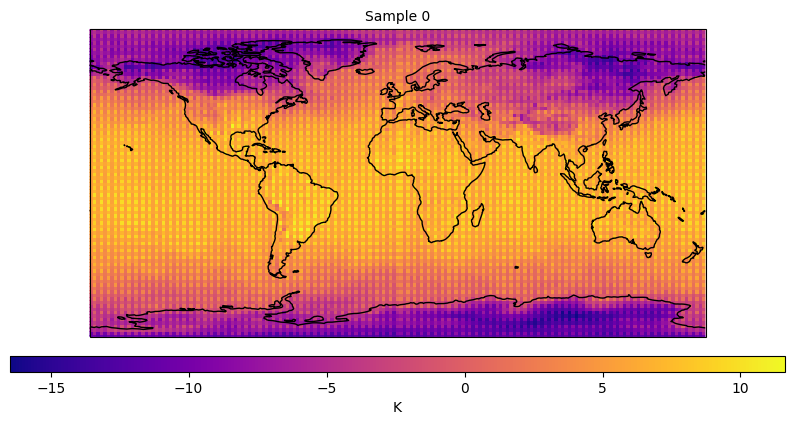

## Codebase for the implementation of Diffusion Transformers to generate temperature maps

This code is built on the original implementation of Scalable Diffusion Models with Transformers (DiT)<br><sub>Official PyTorch Implementation</sub>

This repo contains PyTorch model definitions, description, and training/sampling code for our implementation of generating temperature maps 
diffusion models with transformers (DiTs).


We train diffusion models, replacing the commonly-used U-Net backbone with a transformer that operates on 
patches. 


## Setup

Login to JURECA system

Load `uv` with command `ml uv`

Run command `uv sync` to create virtual environment

## Training DiT

The training script for DiT is  [`train.py`](train.py). This script can be used to train class-conditional 
DiT models, but it can be easily modified to support other types of conditioning. To launch training

```
sbatch train_DiT_jsc.sh

```
## Sampling DiT

The sampling script is [`sample_ddp.py`](sample_ddp.py). The script will generate samples from scratch. 

```
sbatch test_DiT.sh
```
Here is a sample generated temperature map.



## Evaluation (FID, Inception Score, etc.)

We include a [`sample_ddp.py`](sample_ddp.py) script which samples a large number of images from a DiT model in parallel. This script 
generates a folder of samples as well as a `.npz` file which can be directly used with [ADM's TensorFlow
evaluation suite](https://github.com/openai/guided-diffusion/tree/main/evaluations) to compute FID, Inception Score and
other metrics. For example, to sample 50K images from our pre-trained DiT-XL/2 model over `N` GPUs, run:

## Group Tasks

Team 1: Implement Evaluation Metrics

Team 2: Conditioning based on seasonal forcings 

Team 3: Conditioning based on seasonal forcings + Day + Hour

Team 4: Conditioning based on temperature from previous time steps
